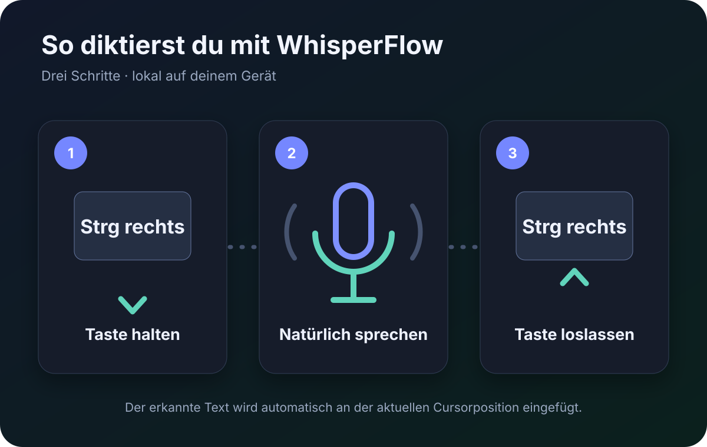

# WhisperFlow

WhisperFlow ist ein vollständig lokales Push-to-talk-Diktat für **Windows 10/11**
und **Linux (Wayland/PipeWire)**. Halte die rechte Strg-Taste, sprich und lasse
die Taste los: Der erkannte Text wird an der aktuellen Cursorposition eingefügt.
Audio und Transkripte bleiben auf dem Gerät.

Ausführliche Hinweise: [Installation und Aktualisierung](docs/INSTALLATION.md) ·
[Betrieb, Datenschutz und Fehlerbehebung](docs/BETRIEB.md)

## Installation

Repository herunterladen oder klonen und anschließend **genau ein Skript**
starten. Der Installer öffnet ein Fenster und führt sichtbar durch Systemprüfung,
App-Installation, Engine, Modell, Autostart und Abschlussprüfung.

### Windows

Im Repository Rechtsklick auf `install.ps1` → „Mit PowerShell ausführen“, oder:

```powershell
powershell -ExecutionPolicy Bypass -File .\install.ps1
```

### Linux

```bash
bash ./install.sh
```

Falls Python 3.11 oder neuer fehlt, richtet das Startskript es automatisch ein.
Fehlende Linux-Komponenten für PipeWire, Zwischenablage und Tastatureingabe
installiert das Fenster über die grafische Systemabfrage. Wird der Benutzer
dabei der Gruppe `input` hinzugefügt, fordert der Installer am Ende einmal zum
vollständigen Ab- und Anmelden auf.

Vorausgesetzt wird ein 64-Bit-x86-System (`x86_64`/`AMD64`). Unter Linux werden
`apt`, `dnf` und `pacman` automatisch unterstützt. Weitere Details, Zielpfade
und eine Anleitung für Aktualisierungen stehen in der
[Installationsdokumentation](docs/INSTALLATION.md).

Während der Installation kann eines von fünf lokalen Whisper-Modellen gewählt
werden:

| Modell | Download | Eignung |
|---|---:|---|
| Tiny | 75 MB | maximale Geschwindigkeit |
| Base | 142 MB | schnell und leicht |
| Small | 465 MB | empfohlener Standard |
| Medium | 1,5 GB | höhere Genauigkeit |
| Large v3 Turbo | 1,6 GB | beste Qualität, benötigt mehr Leistung |

Alle Downloads sind auf feste Versionen gepinnt und werden vor der Übernahme
mit Größe und SHA-256 geprüft. Die App-Abhängigkeiten liegen in einer eigenen
Python-Umgebung und verändern keine bereits vorhandenen Python-Pakete.

## Bedienung



1. Im nach der Installation geöffneten Einstellungsfenster das Mikrofon wählen.
2. Rechte Strg-Taste halten und natürlich sprechen.
3. Taste loslassen und kurz auf die lokale Erkennung warten.

Ein Doppelklick auf das Tray-Symbol öffnet die Einstellungen. Dort lassen sich
Mikrofon, Backend, Fachwörter, Aufnahmegrenzen und das Sprachmodell jederzeit
ändern. Für die fünf integrierten Modelle genügt die Auswahl im Feld
„Sprachmodell“; WhisperFlow lädt eine fehlende Datei mit sichtbarem Fortschritt.
Eine eigene GGML-Datei kann ebenfalls gewählt werden.

Die gewählte Tastenkombination ist derzeit fest auf **rechte Strg-Taste**
gesetzt. Das Tray-Menü kann außerdem das letzte Ergebnis erneut in die
Zwischenablage kopieren.

Das Overlay und die Animationen verwenden unter Windows und Linux dieselbe
PyQt-Oberfläche und dasselbe Farbsystem. Rot steht für Aufnahme, Gelb für lokale
Verarbeitung und Grün für erfolgreich gesendetes Einfügen.

## Plattformdetails

- **Windows:** Audio über WASAPI (`sounddevice`), globaler Rechts-Strg-Hook und
  Einfügen über die Windows-Eingabe- und Zwischenablage-APIs.
- **Linux:** Audio über PipeWire, exklusiver sicherer Trigger über `evdev` und
  Einfügen über `wl-copy`/`ydotool`. Die App gibt Eingabegeräte bei Sperre,
  Suspend oder einem ausgebliebenen Heartbeat frei.
- **Beide:** dieselbe Oberfläche, Modellverwaltung, `whisper.cpp`-Engine,
  Verarbeitung und lokale Datenschutzgrenzen.

Der mitgelieferte CPU-Build funktioniert ohne herstellerspezifische GPU-Laufzeit.
Fortgeschrittene Nutzer können in den Einstellungen einen eigenen
Vulkan-fähigen `whisper-server` verwenden und das Backend entsprechend ändern.

## Datenschutz

- Standardmäßig werden Aufnahme und Transkript nach dem Einfügen gelöscht.
- Temporäre WAV-Dateien liegen ausschließlich im privaten Laufzeitverzeichnis.
- `whisper-server` bindet nur an `127.0.0.1` und verwendet pro Start einen
  zufälligen privaten Pfad.
- Nur der ausdrücklich aktivierte Diagnosemodus bewahrt eine begrenzte Anzahl
  lokaler Audio-/Textfälle auf.
- Das letzte Ergebnis bleibt im Arbeitsspeicher und kann über das Tray erneut
  kopiert werden.

## Befehle und Entwicklung

Nach der Installation steht unter Linux `whisperflow` zur Verfügung; unter
Windows liegt „WhisperFlow“ im Startmenü.

```bash
local-dictation --benchmark
local-dictation --benchmark --json
local-dictation --purge
```

Unter Linux ist `whisperflow` der installierte Wrapper für dieselben Befehle.
Unter Windows können Befehle mit
`%LOCALAPPDATA%\WhisperFlow\venv\Scripts\python.exe -m local_dictation`
ausgeführt werden. Betrieb, Logs und Reparaturschritte sind in
[docs/BETRIEB.md](docs/BETRIEB.md) beschrieben.

Tests aus einem Entwicklungs-Checkout:

```bash
python -m pip install -e . pytest
python -m pytest -m "not integration and not live"
```

Der optionale Integrationstest benötigt die installierte Engine und Modelle:

```bash
LOCAL_DICTATION_RUN_INTEGRATION=1 python -m pytest -m integration
```

## Deinstallation

Die vollständigen, plattformspezifischen Schritte stehen unter
[Deinstallation](docs/INSTALLATION.md#deinstallation). `--purge` entfernt nach
Rückfrage unter Linux Konfiguration, verwaltete Modelle und Diagnosedaten; unter
Windows werden die expliziten App-Pfade per PowerShell entfernt. Eine selbst
gewählte Modelldatei außerhalb des verwalteten Datenordners wird nie gelöscht.

## Lizenz

WhisperFlow wird unter der [MIT-Lizenz](LICENSE) veröffentlicht.
